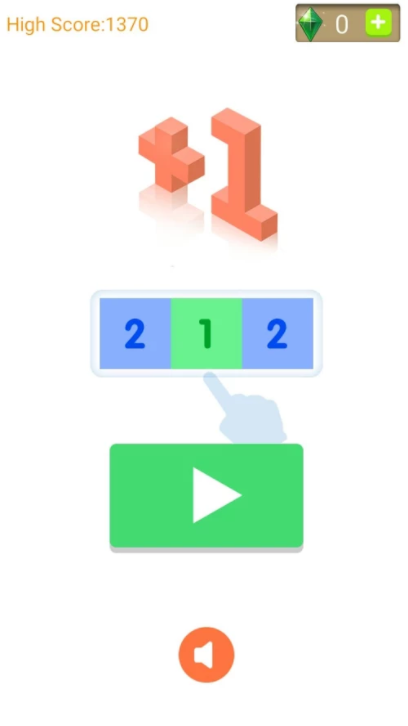
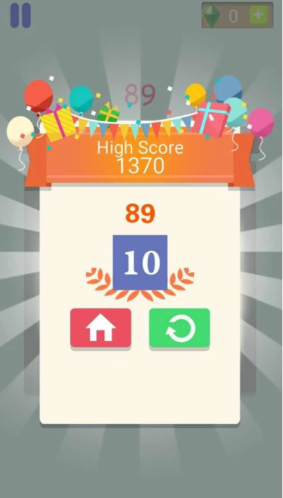

# cocos2dx-lua-ClickMeAddOne
###基于cocos2dx-lua 开发的一个小游戏  点我加一
####添加admob广告，发布谷歌平台

<link rel="stylesheet" href="styles/default.css">

- lua代码 通过quick-lua提供的LuaJavaBridge
- 利用包名，根据java的反射机制
- http://dualface.github.io/blog/2013/01/01/call-java-from-lua/
<pre><code class="java">
--[[
	调用安卓本地类，显示原生对话框
	默认按两个按钮 OK  Cancle
	title   : 标题
	message : 内容
	listener    : 回调，仅有OK按钮的回调
]]
function NativeHelper.showAlert(title, message, listener)
	-- body
	local javaClassName = "org/cocos2dx/lua/AppActivity"
	local javaMethodName = "showAlertDialog"
	local javaParams = {
	    title,
	    message,
	    listener,
	}
	local javaMethodSig = "(Ljava/lang/String;Ljava/lang/String;I)V"
	luaj.callStaticMethod(javaClassName, javaMethodName, javaParams, javaMethodSig) 
end
</code></pre>

###小游戏截图

 
  